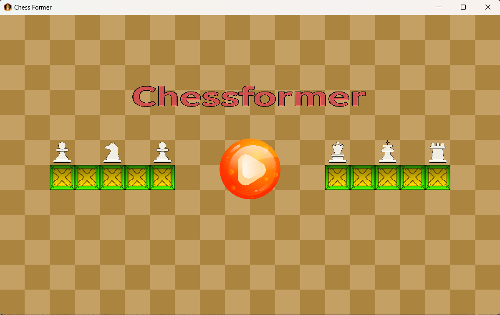
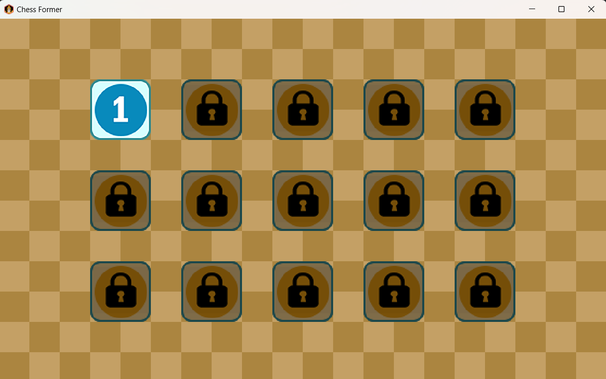
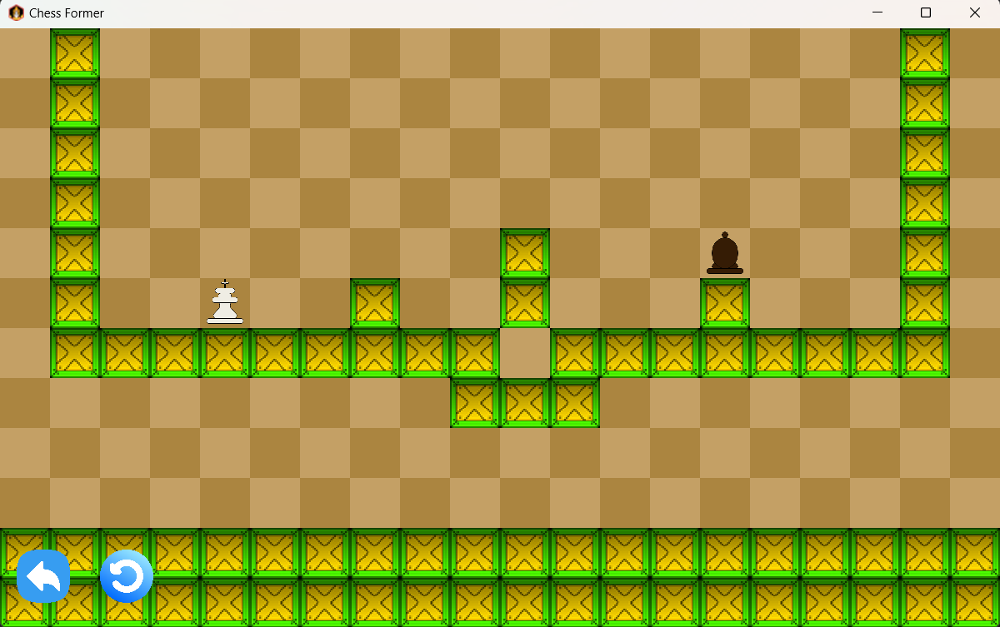

# PROGAMEJAM PROPTIT
## 1. Thông tin nhóm
#### Tên dự án: Chess former
#### Link dự án: 
https://github.com/lucnguyen1375/Chest-Former
#### Thành viên nhóm:
- Nguyễn Văn Minh Lực
- Văn Thị Mai Linh
- Đỗ Đức Tuấn Anh
- [Mentor] Anh Bùi Thế Vĩnh Nguyên
- [Mentor] Chị Đoàn Thảo Vân
#### Mô hình làm việc
- Team hoạt động theo mô hình Scrum, sử dụng Linear để quản lí công việc. Các công việc được keep track đầy đủ trên Linear: https://linear.app/lucnguyen/team/CF/all
- Mỗi tuần team sẽ ngồi lại để review công việc đã làm, cùng nhau giải quyết vấn đề và đề xuất giải pháp cho tuần tiếp theo. Sau đó sẽ có buổi demo cho mentor để nhận phản hồi và hướng dẫn
#### Version Control Strategy
- Team hoạt động theo Gitflow để quản lí code. Mỗi thành viên sẽ tạo branch từ develop để làm việc, các branch được đặt theo format ``feature/ten-chuc-nang``, sau khi hoàn thành sẽ tạo Pull Request để review code và merge vào develop
- Các nhánh chính:
    + master: chứa code ổn định, đã test và kiểm tra kĩ lưỡng
    + develop: chứa code mới nhất, đã qua review và test
    + feature/: các nhánh chứa code đang phát triển, short-live, sau khi hoàn thành sẽ merge vào develop

- Sau mỗi tuần, team sẽ merge ``develop`` vào ``master`` để release phiên bản mới
## 2. Giới thiệu dự án
#### Mô tả: 
Game chess former là một trò chơi giải đố kết hợp cơ chế di chuyển của các quân cờ vua. Người chơi cần vượt qua các màn chơi bằng cách sử dụng quy tắc di chuyển đặc trung của từng loại quân cờ (như xe, mã, tượng, hậu,..) để đến được điểm đích.
## 3. Các chức năng chính
- Người chơi có thể chuyển đổi giữa các loại quân cờ, mỗi quân cờ có quy tắc di chuyển riêng như trong cờ vua
- Mỗi màn là một thiết kế map riêng, người chơi cần đi đến đích để qua màn
- Các màn sẽ mở khoá lần lượt.

## 4. Công nghệ
#### 4.1 Công nghệ sử dụng
- java 23
- LibGDX https://libgdx.com/
- Gradle 23
- TileMap
...
#### 4.2 Cấu trúc dự án

```
Chess-Former/
├── assets/
│   ├── Dot_Assets/
│   ├── Map_Assets/
│   ├── Dot_Assets/
│   ├── skin/
│   ├── assets.txt
│   ├── chess-former.log
├── core/
│   └── src/
│       └── main/
│           └── java/
│               └── com/
│                   └── ChessFormer/
│                       ├── ChessFormer.java (Main class)
│                       ├── FileLogger.java
│                       ├── Game_Utilz
│                       ├── controller
│                       │   ├── ChessDirect
│                       │   └── ChessManager
│                       │   └── MapController
│                       ├── screen/
│                       │   ├── Button.java
│                       │   ├── GameScreen.java
│                       │   ├── LevelButton.java
│                       │   ├── MainScreen.java
│                       │   └── MenuScreen.java
│                       ├── model.chess/
│                       │   ├── Chess.java
│                       │   ├── Dot.java
│                       └── controller/
├── gradle/
├── build.gradle
├── settings.gradle
└── README.md
```

Diễn giải:
- **assets:** Chứa các tài nguyên như hình ảnh
- **core:** Chứa các class chính của game như model, view, controller
## 5. Ảnh và video demo
#### Ảnh Demo
- Màn hình chính



- Menu



- Map 1




#### Video Demo
- Link video: https://www.youtube.com/watch?v=xyM5gR3nNl8

## 6. Các vấn đề gặp phải
#### Vấn đề 1: 
Xung đột code giữa các model với nhau
#### Hành động giải quyết
- Do việc chia nhiệm vụ chưa logic
- Chia lại mỗi người đảm nhận 1 phần độc lập, để không bị phụ thuộc vào nhau
#### Kết quả
- Nhóm làm việc hiệu quả

#### Vấn đề 2: 
- Class chưa được phân chia rõ ràng, các class có chức năng trùng lặp nhau
#### Hành động giải quyết
- Thực hiện tách class theo mô hình MVC
#### Kết quả
- Class rõ ràng theo chức năng, tuân theo mô hình MVC

#### Vấn đề 3:
- Vấn đề logic toạ độ giữa các object với nhau
#### Hành động để giải quyết
- Họp giải quyết, thống nhất sử dụng chung 1 loại object, 1 loại toạ độ

#### Kết quả
- Không còn bị conflict về toạ độ
## 7. Kết luận
#### Kết quả đạt được
- Game hoàn thành những chức năng cơ bản, tuy nhiên chưa được trau dồi về mặt hình ảnh.
#### Hướng phát triển tiếp theo:
- Trau chuốt, chỉnh sửa về mặt hình ảnh cho các màn chơi
- Thêm các thao tác phụ như âm thanh
- Thêm chức năng phong quân cho quân cờ tốt khi đi lên đỉnh map.


