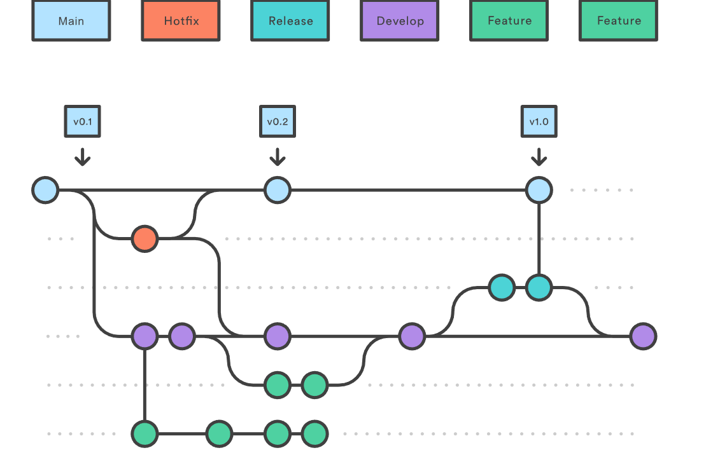

# PROGAMEJAM PROPTIT

## 1. Thông Tin Nhóm

**Tên Dự Án:** Chess Former

**Link Dự Án:** [GitHub Link](https://github.com/lucnguyen1375/Chest-Former)

**Thành Viên Nhóm:**
- Nguyễn Văn Minh Lực
- Văn Thị Mai Linh
- Đỗ Đức Tuấn Anh
- [Mentor] Bùi Thế Vĩnh Nguyên 
- [Mentor] Đoàn Thảo Vân


### Mô hình làm việc

Team hoạt động theo mô hình Scrum, sử dụng Linear để quản lý công việc. Các công việc được keep track đầy đủ trên Linear.
- Link linear: [Linear Link](https://linear.app/lucnguyen/project/chest-former-4276e337b813/overview)

Mỗi tuần, team sẽ ngồi lại để review công việc đã làm, cùng nhau giải quyết vấn đề và đề xuất giải pháp cho tuần tiếp theo. Sau đó sẽ có buổi demo cho mentor để nhận phản hồi và hướng dẫn.

### Version Control Strategy


Team hoạt động theo Gitflow để quản lý code. Mỗi thành viên sẽ tạo branch từ `develop` để làm việc, các branch đặt theo format `feature/ten-chuc-nang`, sau khi hoàn thành sẽ tạo Pull Request để review code và merge vào develop
- Các nhánh chính:
    - `master`: Chứa code ổn định, đã qua kiểm tra và test kỹ lưỡng
    - `develop`: Chứa code mới nhất, đã qua review và test
    - `feature/`: Các nhánh chứa code đang phát triển, short-live, sau khi hoàn thành sẽ merge vào `develop`.



Sau mỗi tuần, team sẽ merge `develop` vào `master` để release phiên bản mới.


## 2. Giới Thiệu Dự Án

**Mô tả:** Chessformer là một trò chơi giải đố đầy thử thách, trong đó bạn chỉ có thể di chuyển theo quy tắc của quân cờ mà bạn được giao. Hãy tận dụng khả năng độc đáo của từng quân cờ để vượt qua từng cấp độ và tiến tới vị trí quân cờ mục tiêu.

## 3. Các Chức Năng Chính

- Người chơi có thể di chuyển quân cờ theo quy tắc của quân cờ đó
- Người chơi có thể chọn màn chơi đã được mở khóa

## 4. Công nghệ

### 4.1. Công Nghệ Sử Dụng
- Java 8
- LibGDX
- Gradle

### 4.2 Cấu trúc dự án

```
Chess-Former/
├── assets/
│   ├── Dot_Assets/
│   ├── Map_Assets/
│   ├── Dot_Assets/
│   ├── skin/
│   ├── assets.txt
│   ├── chess-former.log
├── core/
│   └── src/
│       └── main/
│           └── java/
│               └── com/
│                   └── ChessFormer/
│                       ├── ChessFormer.java (Main class)
│                       ├── FileLogger.java
│                       ├── Game_Utilz
│                       ├── controller
│                       │   ├── ChessDirect
│                       │   └── ChessManager
│                       │   └── MapController
│                       ├── screen/
│                       │   ├── Button.java
│                       │   ├── GameScreen.java
│                       │   ├── LevelButton.java
│                       │   ├── MainScreen.java
│                       │   └── MenuScreen.java
│                       ├── model.chess/
│                       │   ├── Chess.java
│                       │   ├── Dot.java
│                       └── controller/
├── gradle/
├── build.gradle
├── settings.gradle
└── README.md
```

Diễn giải:
- **assets:** Chứa các tài nguyên như hình ảnh
- **core:** Chứa các class chính của game như model, view, controller


## 5. Ảnh và Video Demo

**Ảnh Demo:**


**Video Demo:**
[Video Link](#)


## 6. Các Vấn Đề Gặp Phải

### Vấn Đề 1: [Mô tả vấn đề]
**Ví dụ:** Game gặp phải vấn đề hiệu năng kém, fps thấp dù không có nhiều đối tượng trên màn hình

### Hành Động Để Giải Quyết

**Giải pháp:** Do việc tạo object quá nhiều, nên dẫn tới tràn ram và giảm hiệu năng
- Sử dụng Design Pattern Object Pool để tái sử dụng object. Khi object không còn sử dụng, sẽ được đưa vào pool để sử dụng lại.

### Kết Quả

- Sau khi sử dụng Object Pool, hiệu năng game đã được cải thiện, fps tăng lên đáng kể. Từ *30fps lên 60fps* (Rõ ràng hơn với số liệu cụ thể)

### Vấn Đề 2: [Mô tả vấn đề]
**Ví dụ:** Có quá nhiều class quái khác nhau, dù chúng có nhiều điểm chung


### Hành Động Để Giải Quyết

**Giải pháp:** Sử dụng Design Pattern Builder để tạo các object quái với các thuộc tính khác nhau mà không cần tạo nhiều class. Ngoài ra sử dụng Strategy Pattern để tạo các hành vi khác nhau cho các object quái mà không cần tạo nhiều class.

### Kết Quả

- Sau khi sử dụng Builder và Strategy Pattern, việc tạo các object quái đã trở nên dễ dàng hơn, không cần tạo nhiều class. Có thể chỉ cần config các thuộc tính và hành vi cho object quái mà không cần tạo nhiều class.

## 7. Kết Luận

**Kết quả đạt được:** [Mô tả kết quả đạt được sau khi giải quyết các vấn đề]

**Hướng phát triển tiếp theo:** [Mô tả hướng phát triển tiếp theo của dự án]
